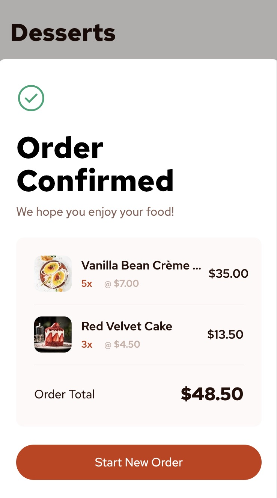

# Frontend Mentor - Product list with cart solution

This is a solution to the [Product list with cart challenge on Frontend Mentor](https://www.frontendmentor.io/challenges/product-list-with-cart-5MmqLVAp_d). Frontend Mentor challenges help you improve your coding skills by building realistic projects. 

## Table of contents

- [Overview](#overview)
  - [The challenge](#the-challenge)
  - [Screenshot](#screenshot)
  - [Links](#links)
- [My process](#my-process)
  - [Built with](#built-with)
  - [What I learned](#what-i-learned)
  - [Continued development](#continued-development)

## Overview

### The challenge

Users should be able to:

- Add items to the cart and remove them
- Increase/decrease the number of items in the cart
- See an order confirmation modal when they click "Confirm Order"
- Reset their selections when they click "Start New Order"
- View the optimal layout for the interface depending on their device's screen size
- See hover and focus states for all interactive elements on the page

### Screenshot





### Links

- Solution URL: [GitHub](https://github.com/Ayako-Yokoe/product-list-with-cart-main)
- Live Site URL: [Vercel](https://product-list-with-cart-six-theta.vercel.app/)

## My process

### Built with

- Semantic HTML5 markup
- CSS custom properties
- Flexbox
- CSS Grid
- Mobile-first workflow
- [React](https://reactjs.org/) - JS library
- [Vite](https://vite.dev/) - Build tool

### What I learned

I was able to brush up on how data and state are managed in React. I used useContext and now have a much clearer understanding.

```js
export function CartProvider({children}) {
  const [cart, dispatch] = useReducer(cartReducer, initialDesserts);

  return (
    <CartStateContext.Provider value={cart}>
      <CartDispatchContext.Provider value={dispatch}>
        {children}
      </CartDispatchContext.Provider>
    </CartStateContext.Provider>
  )
}

function cartReducer(state, action) {
  switch(action.type) {
    case "add": {
      ...
    }
    case "decrement": {
      ...
    }
    ...
  }
}
```

### Continued development

I’ll continue learning more about data management, especially reducers. I’ll keep practicing until I can code with muscle memory and think faster.
# product-list-with-cart-main
